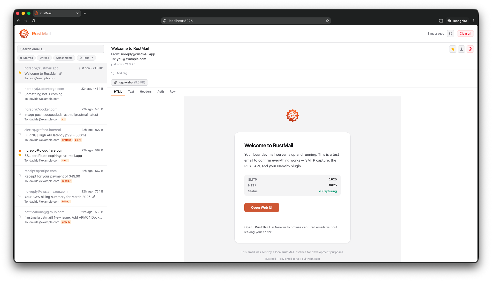
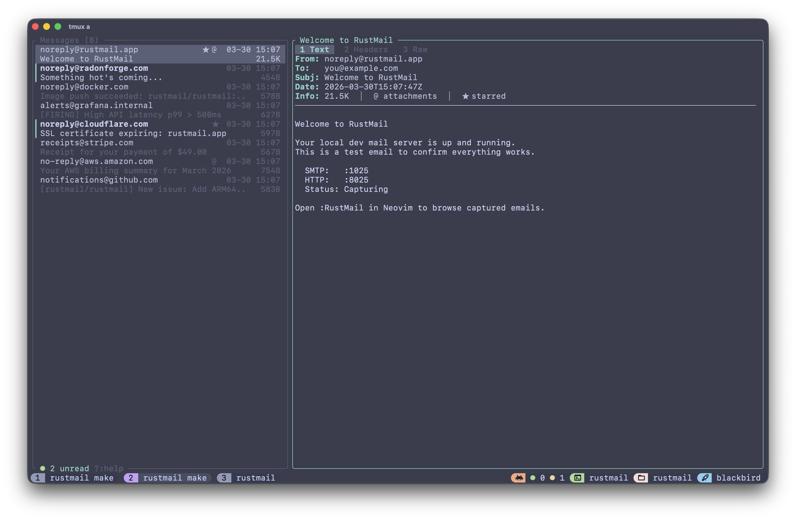

<p align="center">
  
</p>

<h1 align="center">RustMail</h1>

<p align="center">
  A fast, self-hosted SMTP mail catcher for development and testing.<br>
  Capture outbound email, inspect it in a modern UI, and assert on it in CI.
</p>

<p align="center">
  <a href="https://github.com/rustmailapp/rustmail/actions/workflows/ci.yml"></a>
  <a href="https://hub.docker.com/r/smyile/rustmail"></a>
  <a href="https://github.com/rustmailapp/rustmail/releases/latest"></a>
  <a href="#license"></a>
</p>

<p align="center">
  <a href="https://docs.rustmail.app">Documentation</a> · <a href="https://docs.rustmail.app/api/">API Reference</a> · <a href="https://hub.docker.com/r/smyile/rustmail">Docker Hub</a>
</p>

<p align="center">
  
</p>

## Quick Start

```sh
docker run -p 1025:1025 -p 8025:8025 smyile/rustmail:latest
```

Point your app's SMTP at `localhost:1025`, then open [localhost:8025](http://localhost:8025). Emails appear in real time.

### Docker Compose

```yaml
services:
  rustmail:
    image: smyile/rustmail:latest
    ports:
      - "1025:1025"
      - "8025:8025"
    volumes:
      - rustmail-data:/data
    restart: unless-stopped

volumes:
  rustmail-data:
```

## Install

### Homebrew

```sh
brew install rustmailapp/rustmail/rustmail
```

### Arch Linux (AUR)

```sh
yay -S rustmail-bin
```

### From Source

```sh
git clone https://github.com/rustmailapp/rustmail
cd rustmail && make build
```

### Pre-built Binaries

Download from [GitHub Releases](https://github.com/rustmailapp/rustmail/releases/latest) — Linux (x86_64, aarch64, armv7 — glibc + musl), macOS (Intel + Apple Silicon), and multi-arch Docker images.

## Features

| | |
|---|---|
| **Persistent storage** | SQLite-backed, emails survive restarts. `--ephemeral` for CI. |
| **Full-text search** | FTS5 across subject, body, sender, and recipients. |
| **Real-time UI** | WebSocket push — new email appears instantly. Dark/light mode, keyboard shortcuts. |
| **CI-native** | REST assertion endpoints, CLI assert mode, and a first-party GitHub Action. |
| **Single binary** | Frontend embedded at compile time. ~7 MB, zero runtime dependencies. |
| **Auth header display** | Parses DKIM, SPF, DMARC, and ARC headers with color-coded status badges. |
| **Webhooks** | Fire-and-forget POST on every new message. |
| **Email release** | Forward captured emails to a real SMTP server. |
| **Optional STARTTLS** | Advertised on the normal SMTP port when both `--smtp-tls-cert` and `--smtp-tls-key` are configured. |
| **Export** | Download any email as EML or JSON. |
| **Retention policies** | Auto-purge by age (`--retention`) or count (`--max-messages`). |
| **TUI** | Optional terminal UI client for Neovim and headless workflows. |

## GitHub Action

```yaml
- uses: rustmailapp/rustmail-action@v1

- run: npm test  # your app sends emails to localhost:1025

- uses: rustmailapp/rustmail-action@v1
  with:
    mode: assert
    assert-count: 1
    assert-subject: "Welcome"
```

## CLI Assert Mode

Run as an ephemeral mail catcher that exits with a status code — for CI without the GitHub Action:

```sh
rustmail assert --min-count=2 --subject="Welcome" --timeout=30s
```

## Configuration

Configure via CLI flags, `RUSTMAIL_*` environment variables, or a TOML config file:

```sh
rustmail serve --bind 0.0.0.0 --smtp-port 2525 --http-port 9025
rustmail serve --retention 24 --max-messages 1000
rustmail serve --webhook-url https://hooks.example.com/email
rustmail serve --smtp-tls-cert ./certs/localhost.pem --smtp-tls-key ./certs/localhost-key.pem
```

STARTTLS is optional and uses the same SMTP port via explicit upgrade. RustMail advertises `STARTTLS` only when both the certificate and private key are configured.

See the full [configuration reference](https://docs.rustmail.app/configuration/cli-flags).

## TUI

<p align="center">
  
</p>

A terminal UI that connects to a running RustMail instance. Also available as a [Neovim plugin](https://docs.rustmail.app/integrations/neovim).

## Documentation

Full docs at [docs.rustmail.app](https://docs.rustmail.app):

- [Getting Started](https://docs.rustmail.app/getting-started/introduction)
- [Docker](https://docs.rustmail.app/getting-started/docker)
- [Configuration](https://docs.rustmail.app/configuration/cli-flags)
- [CI Integration](https://docs.rustmail.app/ci-integration/rest-assertions)
- [API Reference](https://docs.rustmail.app/api/)

## License

Licensed under either of:

- [MIT License](LICENSE-MIT)
- [Apache License, Version 2.0](LICENSE-APACHE)

at your option.
