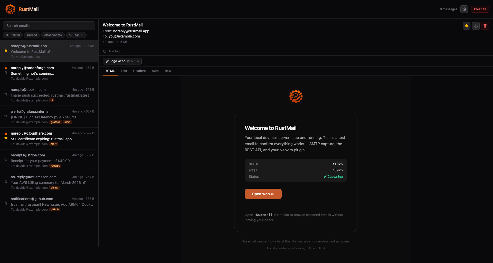

<p align="center">
  
</p>

<h1 align="center">RustMail</h1>

<p align="center">
  A fast, feature-rich SMTP mail catcher built in Rust.<br>
  Single binary. Persistent storage. Modern UI. CI-ready.
</p>

<p align="center">
  <a href="https://github.com/rustmailapp/rustmail/actions/workflows/ci.yml"></a>
  <a href="#license"></a>
</p>

<p align="center">
  <code>~7 MB binary</code> · <code>28 KB JS gzipped</code> · <code>zero runtime dependencies</code>
</p>

<p align="center" style="margin-bottom:unset">
  
</p>

<p align="center">
  Inspired by <a href="https://github.com/mailhog/MailHog">MailHog</a> and <a href="https://github.com/tweedegolf/mailcrab">MailCrab</a>
</p>

## Install

```sh
brew install rustmailapp/rustmail/rustmail
```

Or on Arch Linux (AUR):

```sh
yay -S rustmail-bin
```

Or with Docker:

```sh
docker run -p 1025:1025 -p 8025:8025 -e RUSTMAIL_BIND=0.0.0.0 ghcr.io/rustmailapp/rustmail:latest
```

Or from source:

```sh
git clone https://github.com/rustmailapp/rustmail
cd rustmail && make build
```

## Quick Start

```sh
rustmail
```

Point your app's SMTP at `localhost:1025`, then open [localhost:8025](http://localhost:8025). Emails show up in real time.

## Features

### Core

- **Persistent storage** — SQLite-backed, emails survive restarts (or `--ephemeral` for CI)
- **Full-text search** — FTS5 across subject, body, sender, and recipients
- **Real-time updates** — WebSocket pushes new emails to the UI instantly
- **Modern UI** — dark-mode-first, looks and feels like a real email client

### CI/CD

- **REST assertion endpoints** — `GET /api/v1/assert/count?min=1&subject=Welcome`
- **CLI assert mode** — `rustmail assert --min-count=2 --subject="Welcome" --timeout=30s`
- **GitHub Action** — two-step start + assert, works on Linux and macOS runners
- **Ephemeral mode** — in-memory DB for test pipelines, no cleanup needed

### Advanced

- **DKIM/SPF/DMARC/ARC display** — parses authentication headers, color-coded status badges (no other local catcher does this)
- **Webhook notifications** — fire-and-forget POST on new email via `--webhook-url`
- **Email release** — forward captured emails to a real SMTP server
- **Export** — download as EML or JSON

### Platform Support

Pre-built binaries and multi-arch Docker images for every major platform:

| Platform | Architectures | Format |
|----------|--------------|--------|
| **Linux** | x86_64, aarch64, armv7 | gnu + musl (static) |
| **macOS** | x86_64 (Intel), aarch64 (Apple Silicon) | native |
| **Docker** | amd64, arm64, arm/v7 | multi-arch manifest |

Static musl builds run on Alpine, distroless, and any Linux — no glibc required.

### Developer Experience

- **Keyboard shortcuts** — `j`/`k` navigate, `d` delete, `D` clear all, `/` search, `Esc` close
- **Dark/light theme** — toggle with localStorage persistence
- **Flexible config** — CLI flags, `RUSTMAIL_*` env vars, or TOML config file
- **Retention policies** — `--retention` (hours) and `--max-messages` with automatic enforcement

## GitHub Action

```yaml
- name: Start RustMail
  uses: rustmailapp/rustmail-action@v1

- name: Run tests (your app sends emails to localhost:1025)
  run: npm test

- name: Assert emails were sent
  uses: rustmailapp/rustmail-action@v1
  with:
    mode: assert
    assert-count: 1
    assert-subject: "Welcome"
```

## Documentation

Full docs at [docs.rustmail.app](https://docs.rustmail.app) ([source](docs/)):

- [Getting Started](docs/getting-started/introduction.md)
- [Configuration](docs/configuration/cli-flags.md)
- [CI Integration](docs/ci-integration/rest-assertions.md)
- [Features](docs/features/webhooks.md) — Webhooks, Export, Release, Email Auth, WebSocket
- [Integrations](docs/integrations/neovim.md) — Neovim Plugin
- [API Reference](docs/api/index.md)
- [Docker](docs/docker.md)
- [Architecture](docs/architecture.md)

## License

Licensed under either of:

- [MIT License](LICENSE-MIT)
- [Apache License, Version 2.0](LICENSE-APACHE)

at your option.
